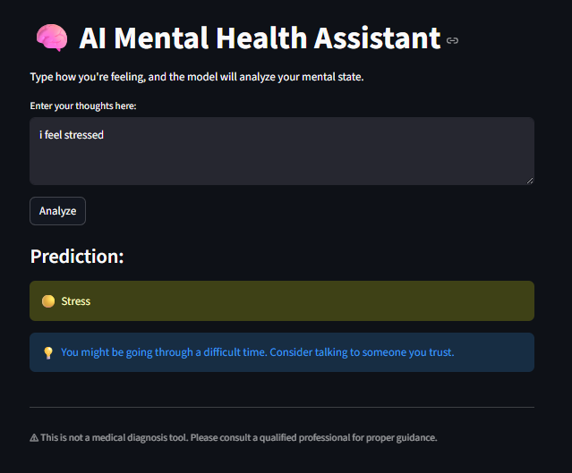

# 🧠 AI Mental Health Assistant

An end-to-end Machine Learning project that detects mental health conditions from user text and provides supportive, safety-aware responses through an interactive Streamlit application.

---

## 🚀 Overview

This project builds a **Mental Health Classification System** that analyzes textual input and predicts psychological conditions such as:

- Anxiety  
- Depression  
- Stress  
- Bipolar  
- Personality Disorder  
- Suicidal  
- Normal  

The system is designed with a **safety-first approach**, especially for detecting high-risk cases like suicidal intent.

---

## 🎯 Objective

- Build a reliable NLP-based classification model  
- Handle **class imbalance effectively**  
- Prioritize **recall for critical classes (e.g., Suicidal)**  
- Provide real-time predictions via a UI  
- Deliver meaningful and supportive responses  

---

## 📊 Dataset

- Mental Health Sentiment Dataset (~26,350 samples)
- 7 labeled mental health categories
- Real-world user-like text inputs

---

## ⚙️ Project Workflow
Raw Text → Cleaning → Tokenization → Lemmatization → TF-IDF → Model Training → Evaluation → Deployment


---

## 🧹 Data Preprocessing

The following preprocessing steps were applied:

- Lowercasing text  
- Expanding contractions  
- Removing special characters & URLs  
- Tokenization using NLTK  
- Stopword removal  
- Lemmatization (WordNet)  
- Rejoining tokens into clean sentences  

👉 This step ensures the model learns **meaningful linguistic patterns instead of noise**.

---

## 🔍 Exploratory Data Analysis (EDA)

- Checked dataset structure and null values  
- Analyzed class distribution  
- Visualized class imbalance  

### 📌 Insight:
- Dataset is **imbalanced**
- “Suicidal” and “Anxiety” are dominant classes

---

## 🔢 Feature Engineering

Used **TF-IDF Vectorization**:

- `max_features = 6000`  
- `ngram_range = (1,2)`  
- `sublinear_tf = True`  
- `min_df = 2`  
- `max_df = 0.95`  

👉 Converts text into numerical form while preserving important word importance.

---

## ✂️ Train-Test Split

- 80% Training  
- 20% Testing  
- Used **stratified sampling** to preserve class distribution  

---

## 🤖 Models Implemented

### 🔹 1. Support Vector Machine (SVM) ✅ BEST MODEL

- Algorithm: `LinearSVC`
- Handles high-dimensional sparse data efficiently  
- Used `class_weight='balanced'`  

---

### 🔹 2. Random Forest

- Ensemble-based model  
- Used for comparison  

---

## ⚖️ Class Imbalance Handling

Handled using:

- Stratified splitting  
- `class_weight='balanced'`  
- Macro F1 optimization  

---

## 📈 Model Evaluation

Evaluation metrics used:

- Accuracy  
- Precision  
- Recall  
- F1 Score  
- **Macro F1 Score (primary metric)**  

---

### 🧠 Why Macro F1?

- Treats all classes equally  
- Prevents bias toward majority classes  
- Crucial for detecting minority classes like **Suicidal**

---

## 🏆 Model Comparison

| Model          | Accuracy | Macro F1 | Observation |
|---------------|---------|----------|------------|
| SVM           | ~0.77   | Best     | Balanced & stable |
| Random Forest | ~0.73   | Lower    | Weak on minority classes |

---

## 🔧 Hyperparameter Tuning

Performed using **GridSearchCV**:

param_grid = {
    'C': [0.01, 0.1, 1, 10],
    'loss': ['hinge', 'squared_hinge'],
    'max_iter': [3000, 5000]
}
✅ Best Parameters:
C = 0.1

--Improved generalization and reduced overfitting.

---

## 🧪 Sample Prediction

Input:

I do not feel like living anymore

Output:

Prediction: Suicidal
⚠️ Please seek immediate help
📞 Helpline (India): 65746483873

---

## 💻 Streamlit Application

An interactive UI built using Streamlit.

Features:
Text input box
Real-time prediction
Color-coded result display
Emergency alert for high-risk cases
Helpline integration
Supportive message display




---

## 💾 Model Deployment

Model saved using:

import joblib
joblib.dump(final_svm, "svm_model.pkl")

---

## 📁 Project Structure
```bash
MENTAL_HEALTH_SENTIMENT_ANALYSIS
│
├── artifacts/               # Saved models & vectorizer
│   ├── svm_model.pkl
│   └── tfidf_vectorizer.pkl
│
├── data/
│   ├── raw/                 # Original dataset
│   │   └── Sentiment_Mental_health_dataset.csv
│   └── cleaned/             # Processed dataset (after preprocessing)
│
├── images/                  # UI screenshots for README
│
├── notebooks/               # Jupyter notebooks (EDA + preprocessing)
│   └── Data_preprocessing_sentiment_analysis.ipynb
│
├── src/                     # Modular source code
│   ├── __init__.py
│   ├── data_ingestion.py    # Load dataset
│   ├── data_preprocess.py   # Text cleaning & preprocessing
│   └── training.py          # Model training & evaluation
│
├── app.py                   # Streamlit UI application
├── requirements.txt         # Dependencies
├── .gitignore               # Ignored files
└── README.md                # Project documentation

```

## ▶️ How to Run
1. Install dependencies
pip install -r requirements.txt
2. Run Streamlit App
streamlit run app.py

---

## ⚠️ Ethical Considerations
This system is not a medical diagnostic tool
Designed only for awareness and assistance
Predictions are based on text and may lack context

---

## 📌 Limitations
No conversational context
Dataset bias may exist
Model cannot replace professional diagnosis

---

## 🚀 Future Improvements
Use deep learning models (BERT, LSTM)
Add chatbot-style conversation
Improve imbalance handling using SMOTE
Deploy as a web service (AWS / HuggingFace)

---

## 🙌 Acknowledgment
Inspired by real-world mental health AI systems

---

## 👨‍💻 Author
Maya
